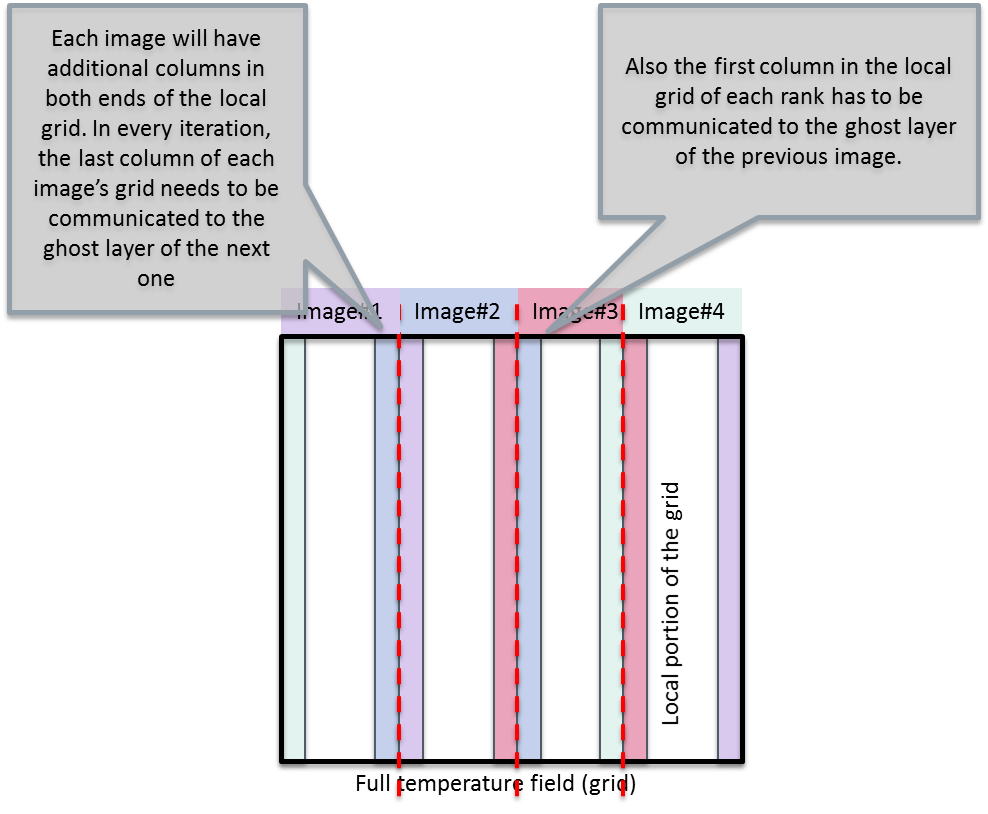

## Parallelizing a heat equation solver with coarrays

Here we will parallelize a 2D heat equation solver (see the more
detailed description [here](heatsolver.md)) using coarrays. We will
start from a complete serial Fortran implementation of the solver
(`heat_serial.F90` and `heat_serial_main.F90`). Take your time to get
acquainted with the program and how to build (use command `make
serial`) and run it.

The approach is to partition the grid into domains column-wise and
have the whole grid declared as a coarray. The images are able to make
the update in their domains independently (i.e. simultaneously)
besides the outermost (domain-bordering) grid points, for which data
has to be read from the neighboring images.

We will then parallelize it with coarrays as follows:

* Declare the temperature grids to be coarrays throughout the code. We
  can restrict ourselves to have the grid width being evenly dividable
  by the number of images (if you want some challenge, you can lift
  this restriction for a general case). Major modifications to the
  initialize subroutine will be needed to have a matching initial
  conditions with the serial implementation.
* Implement a new routine for “halo swap” i.e. performing the update
  of the ghost layers columns (see above). Let us call it exchange.
* The output routine needs to be adapted for either doing the
  single-writer I/O (i.e. gathering the full grid to one image), or
  alternatively, all images can print their local portions of the
  grid.
* Time and energy permitting, also reading in an input file
  (read_input) can be converted to support coarrays parallelization.

A reference coarray implementation is being provided in the
[solution](solution) folder, `heat_coarray.F90` and
`heat_coarray_main.F90`. You can build it using command `make
parallel`.
